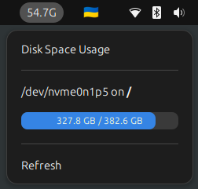

# Free Space Indicator — GNOME Shell Extension

[](https://gitlab.gnome.org/GNOME/gnome-shell)
[](https://www.gnu.org/licenses/gpl-3.0)

A GNOME Shell extension that displays disk free space information in the top panel.



## Features

- Shows free space for your main mount point in the top panel
- Click to view disk usage for all visible mount points
- Choose between icon only, text only, or both in the panel
- Configuration: 
  - Select which mount point to display as primary
  - Hide unwanted mount points from the popup menu
  - Toggle between binary (KiB, MiB, GiB) and decimal (KB, MB, GB) units
  - Set custom update intervals

## Requirements

- GNOME Shell 48+
- `findmnt` command (usually part of util-linux package)

## Installation

### Manual Installation

1. **Download and install the extension files**

   ```sh
   git clone https://github.com/inbalboa/gnome-freespace.git
   cd gnome-freespace
   make install
   ```

2. **Restart GNOME Shell**

   Log out and log back in.

3. **Enable the extension**
   ```sh
   gnome-extensions enable freespace@inbalboa.github.io
   ```

## License

This project is licensed under the GPL-3.0 License - see the [LICENSE](LICENSE) file for details.

---

Made with ❤️ for the GNOME community
